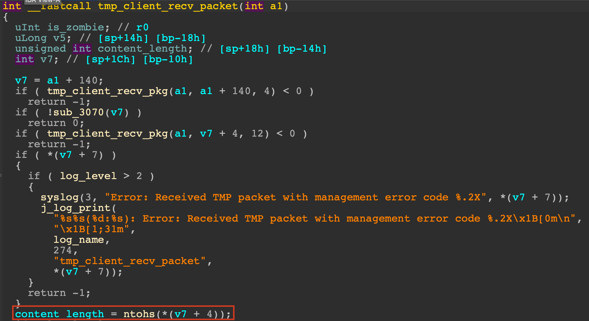
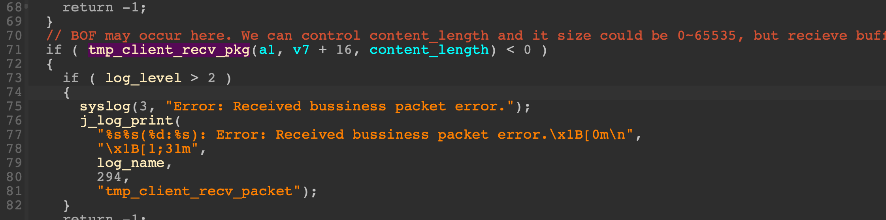

## Vulnerabitily type
Heap-based buffer overflow

## Impact
Remote Code execution

## Vendor
TP-Link

## Product
- Archer AX21(US)_V3_1.1.4 Build 20230219
- Archer AX21(US)_V3.6_1.1.4 Build 20230219

## Affected component
/usr/lib/libtmpv2.so

## Root cause
In the picture below, variable `content_length` is used to indicate the length of content of TMP packet and it can be controlled by an attacker. 

Then, the process will receive another `content_length` bytes into buffer `v7`, but the size of `v7` is smaller than the maximun value of `content_length` which can lead to buffer overflow.

## Exploit
[exploit.mp4](./exploit.mp4)
## Patch
- Archer AX21(US)_V3.6_230621
- Archer AX21(US)_V3_230621

## Warning
Since this vulnerability can lead to remote code execution on LAN side, please update the firmware as soon as possible.

https://www.tp-link.com/us/support/download/archer-ax21/#Firmware
